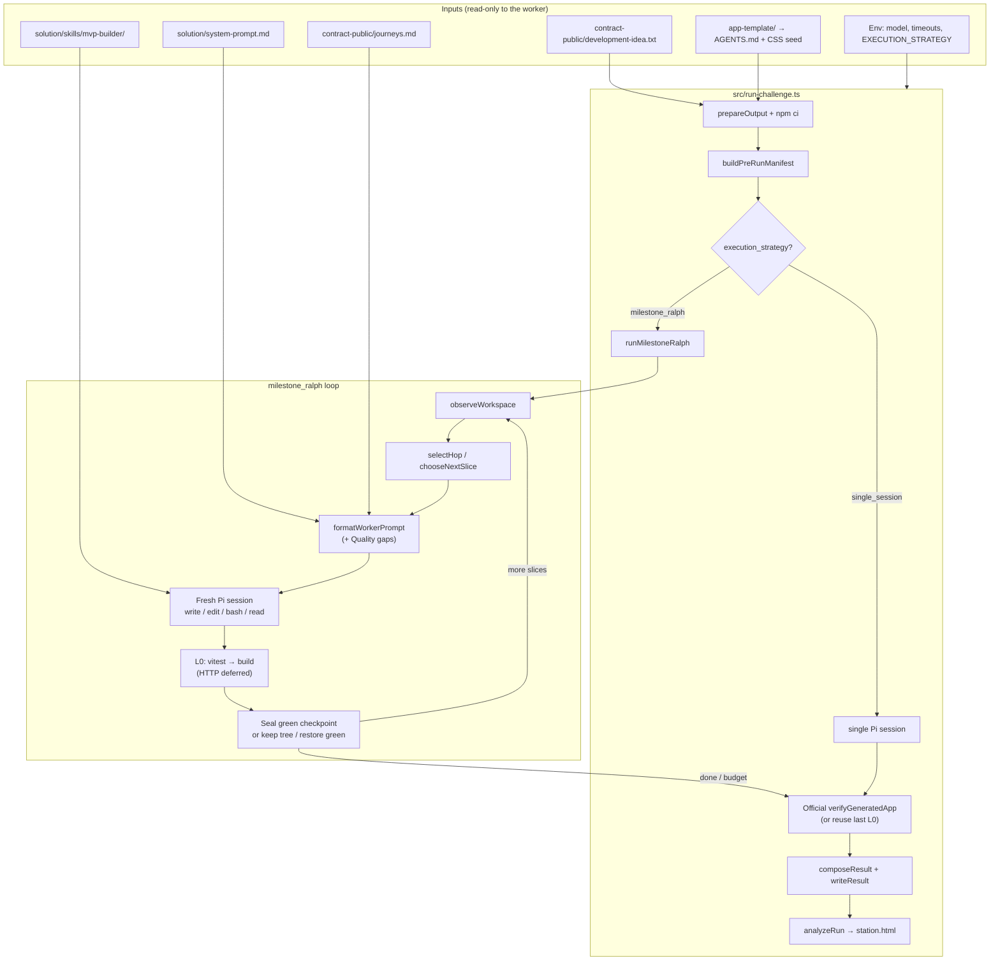
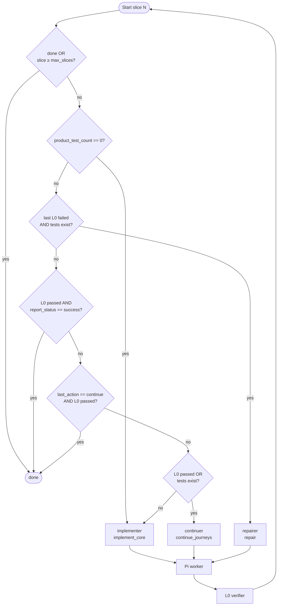
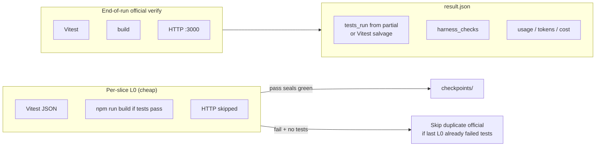

# Harness design & structure (current)

Status: **live on `alisina_experiment_` → public [sina3131/Final_agentcofounder](https://github.com/sina3131/Final_agentcofounder) `main` (as of 2026-09-04)**  
Default execution: **`milestone_ralph`** (fresh Pi session + L0 gate per slice)  
Entry point: `npm run challenge` → `src/run-challenge.ts`

This document describes how the challenge harness is wired today: inputs, orchestration, workers, verification, scoring surfaces, and artifacts. It is the companion to the interactive canvas `v2-harness-architecture.canvas.tsx`.

---

## 1. One-sentence model

A **deterministic orchestrator** repeatedly picks **one hop** (implement / continue / repair / done), runs a **fresh Pi coding agent** in `output/app` with a composed system prompt, then runs a cheap **L0 gate** (Vitest → build). When the run ends, the runner writes harness-owned **`result.json`**, a **run manifest**, and an **analysis station**.

The LLM never owns the final scorecard; it only edits the app and may write `report.partial.json`.

---

## 2. System flowchart (end-to-end)



---

## 3. Milestone-RALPH hop graph

Hops are evaluated **in order** from `src/v2/rhi/baseline.ts` (`harness.workflow.hops`). First matching condition wins.



### Agent roles

| Agent | Action | Responsibility |
|-------|--------|----------------|
| **orchestrator** | (deterministic) | Pick next hop from observation + milestone state |
| **implementer** | `implement_core` | Build modular app + 8–10 UI journey tests; first file writes replace seed |
| **continuer** | `continue_journeys` | Fill missing journeys / critical UX gaps only; stop if suite is already lean + green |
| **repairer** | `repair` | Fix failing L0 tests/UI; prefer domain/storage/components |
| **l0_verifier** | (deterministic) | Vitest; build only if tests pass; HTTP skipped at L0 |
| **done** | `done` | No further worker slices |

---

## 4. How a single slice works

```mermaid
sequenceDiagram
  participant Orch as Orchestrator
  participant Obs as observeWorkspace
  participant Pi as Pi (fresh session)
  participant Disk as output/app
  participant L0 as verify-app L0

  Orch->>Obs: list src/, report.partial.json, modular flags
  Obs-->>Orch: product tests, report status, domain/storage/components?
  Orch->>Orch: selectHop → NextSlice + instruction
  Orch->>Orch: sliceBudgetMs(remaining wall, configured cap)
  Orch->>Pi: system = SP + journeys + AGENTS<br/>user = formatWorkerPrompt(+ quality gaps)
  Pi->>Disk: write/edit modules + tests
  Pi-->>Orch: exit (or SIGTERM on slice timeout)
  Orch->>L0: vitest → build (fail-fast)
  alt L0 pass
    Orch->>Disk: seal checkpoints/green-NN
  else L0 fail, tests exist, prior green
    Orch->>Disk: restore last green (default)
  else L0 fail, no tests
    Note over Orch: keep tree; next hop = implementer again
  end
```

### Slice budget (token / time control)

- Wall clock: `CHALLENGE_TIMEOUT_MS` (default **60 min**).
- Per-slice cap: `MILESTONE_TIMEOUT_MS` / harness `slice_timeout_ms` (default **15 min**).
- Max worker slices: **3**.
- First `implement_core` with **no product tests** is capped at the configured slice timeout and may reserve ~2 min for a later retry when the wall is long — it no longer consumes the entire wall.

---

## 5. Prompt & quality stack (what steers the LLM)

These are **not** auto-scored by L0. They steer product shape and the ≤10-test budget.

| Layer | Path | Role |
|-------|------|------|
| System prompt | `solution/system-prompt.md` | Modular layout, UX/a11y, persistence, **8–10 UI journeys** |
| Journeys | `contract-public/journeys.md` | Implied behavior checklist (add/edit/delete, filter, low-stock, persist, validation, one robustness, +/- stability) |
| Skill | `solution/skills/mvp-builder/SKILL.md` | Same guidance in skill form for Pi |
| App contract | `app-template/AGENTS.md` | CSS vocabulary, report.partial.json shape, test budget |
| RHI instructions | `src/v2/rhi/baseline.ts` | Per-agent slice instructions injected into the worker prompt |
| Quality gaps | `observe.ts` → `formatWorkerPrompt` | After tests exist: missing `domain`/`storage`/`components` + lean-suite reminders |

### Expected generated app shape

```
output/app/
  src/
    domain/          # types + pure ops
    storage/         # *Repository load/save only
    components/      # UI
    App.tsx          # thin wiring
    *.test.tsx       # 8–10 UI journeys (soft max 10)
  report.partial.json  # optional agent summary
  result.json          # harness-owned final scorecard
```

---

## 6. Verification layers



- **L0** decides whether to seal a green checkpoint and which hop comes next.
- **Official verify** produces the audited `harness_checks` in `result.json`.
- If the last slice already failed Vitest, official verify **reuses** that L0 (no duplicate rebuild).
- Missing `report.partial.json` after a green official verify can be **salvaged** from Vitest JSON into `tests_run`.
- Wall SIGTERM (**exit 124**) after a green verify is **not** treated as product failure.

---

## 7. Repository map (what connects to what)

```
Final_agentcofounder/          # public: github.com/sina3131/Final_agentcofounder
├── contract-public/           # Public contract (idea + journeys)
├── solution/                  # Organizer prompts + mvp-builder skill
├── app-template/              # Seed app (Vite/React/Vitest + AGENTS.md)
├── src/
│   ├── run-challenge.ts       # CLI entry, Pi launch, official verify, analyze
│   ├── prepare-output.ts      # Seed → output/app
│   ├── verify-app.ts          # L0 + official verify
│   ├── result.ts              # composeResult / salvage rules
│   └── v2/
│       ├── config.ts          # EXECUTION_STRATEGY, harness_owned_verify
│       ├── manifest.ts        # run-manifest.json provenance
│       ├── analyze-run.ts     # station + ledger
│       ├── cost-model.ts      # competition-weighted cost + VOI scoring
│       ├── quality/           # rubric matrix
│       ├── sensors/           # architecture / a11y / persistence
│       ├── voi/               # adaptive hop selection + quality floor
│       ├── context/           # stable/volatile context intelligence
│       ├── harness-memory/    # cross-run patterns
│       ├── milestone-ralph/   # RALPH loop
│       │   ├── run.ts         # slice loop, budgets, ralphProcessExit
│       │   ├── observe.ts     # workspace + quality gaps
│       │   ├── orchestrator.ts
│       │   ├── checkpoint.ts
│       │   └── state.ts
│       └── rhi/               # Harness document + hop selection
│           ├── baseline.ts    # Production v0 harness
│           ├── materialize.ts # selectHop, formatContractPrompt
│           ├── schema.ts
│           └── loop.ts        # Offline RHI optimizer (not challenge path)
├── output/app/                # Live generated app (ephemeral)
└── artifacts/runs/<id>/       # Immutable evidence per run
    ├── run-manifest.json
    ├── milestone-state.json
    ├── slices/mNN/            # prompt, events, L0, sessions
    ├── checkpoints/
    ├── result.json
    └── app/                   # Snapshot of generated app
```

---

## 8. Artifacts & measurement

| Artifact | Meaning |
|----------|---------|
| `artifacts/runs/<id>/events.jsonl` | Combined Pi telemetry |
| `slices/mNN/prompt.md` | Exact user prompt for that slice |
| `slices/mNN/l0.json` | Pass/fail + summary |
| `milestone-state.json` | Sealed hops, last L0, green checkpoint |
| `run-manifest.json` | Config hash, prompt hashes, template tree, outcome |
| `result.json` | Spec scorecard: journeys, harness_checks, tokens |
| `artifacts/analysis/<id>/station.html` | Human-readable trajectory |

**Important:** the runner does **not** load `.env`. Export vars in the shell, or rely on code defaults (60m wall / 15m slice / 3 slices).

---

## 9. Quality rubric vs automation

| Rubric area | How it is pushed | Auto-checked by L0? |
|-------------|------------------|---------------------|
| API / Maintainability | Modular folder requirements + observe gaps | No (file layout only observed for continuer prompts) |
| Robustness | Journeys + prompts (validation, one persistence path) | Only if tests assert it |
| Usability | aria-invalid, confirm delete, stable +/- | Only if tests assert it |
| Persistence | Versioned key, defensive parse | Refresh / recovery tests if written |
| Integration readiness | domain / storage / components split | No |

L0 is intentionally **mechanical** (tests/build/HTTP). Product quality is **prompt-steered** and **test-asserted**.

---

## 10. Defaults cheat sheet

| Variable | Default | Purpose |
|----------|---------|---------|
| `EXECUTION_STRATEGY` | `milestone_ralph` | Fresh Pi + L0 per slice |
| `CHALLENGE_TIMEOUT_MS` | `3600000` (60m) | Whole-run wall |
| `MILESTONE_TIMEOUT_MS` | `900000` (15m) | Per-slice Pi cap |
| `MILESTONE_MAX_SLICES` | `3` | Max worker hops |
| `CHALLENGE_THINKING` | `off` | Pi thinking level |
| Test budget (prompt) | **8–10** UI journeys | Soft max 10; no domain/repo unit suites |
| `CONTEXT_INTELLIGENCE` | on (`0` disables) | Lean volatile prompts + milestone-context.json |
| `RALPH_ADAPTIVE` | on (`0` disables) | VOI action scoring + early stop |

---

## 11. Context intelligence, sensors, VOI, memory

Cost-aware loop (default **on**):

1. **Quality matrix** (`src/v2/quality/matrix.ts`) — maps sensors to ~100-pt readiness pillars.
2. **Sensors → diagnosis** — deterministic findings before any Pi call; **pre-agent gate** stops when no high-value gap remains **and** domain+storage exist.
3. **Cost-aware VOI** (`src/v2/cost-model.ts` + `src/v2/voi/`) —  
   `score = (quality_gain × P(success)) / (input + 3×output + 0.1×cache_read)`.  
   Output-heavy hops are expensive; prefer stop over low-value continues.  
   **Quality floor:** do not early-stop while domain/storage (or other high-value gaps) remain — cheap L0-green monoliths were exiting via `voi_below_cost_threshold` without a fix-architecture slice.
4. **Slice contracts** (`src/v2/context/slice-contract.ts`) — surgical user prompts: objective, evidence, files, do-not-modify, success, **output budget**.
5. **Stable prompt hashing** — warns on system-append drift between slices (cache killer).
6. **Output governance** — worker protocol: no long prose, ≤80 token finale, stop after one verify.
7. **result.json** — `competition_weighted_tokens` and `weighted_efficiency_score` (journeys_passed / weighted).
8. **Harness memory** — evidence-backed rules across runs (never auto-edits harness source).

Optimization hierarchy: avoid Pi → fewer turns → control output → minimize uncached input → maximize cache → quality per test.

---

## 12. Related docs

- `docs/v2/TEAM-GUIDE.md` — team operating notes, RALPH summary, experiments  
- `docs/v2/PLAN.md` — longer research plan  
- `docs/v2/CONTROL-APP.md` — control UI  
- Interactive canvas: Cursor canvas **Harness architecture (current)** (`v2-harness-architecture.canvas.tsx`)
